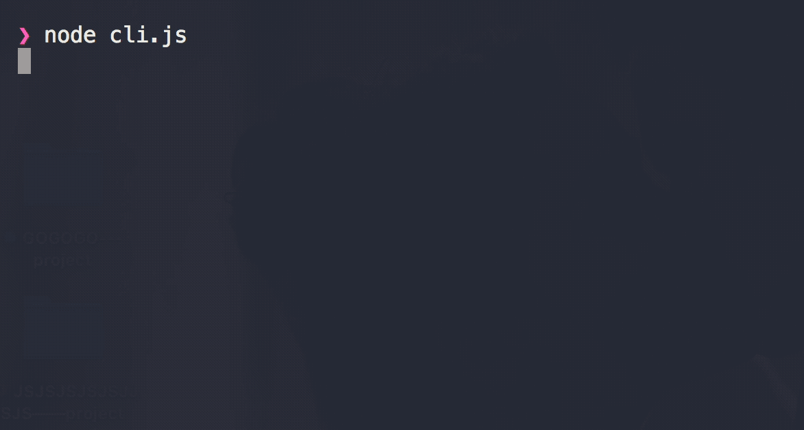
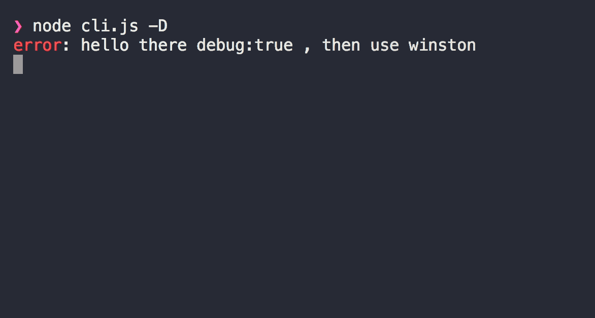

# two-log-cli [](https://travis-ci.org/chinanf-boy/two-log-cli) [](https://codecov.io/gh/chinanf-boy/two-log-cli?branch=master)

> switch `ora` and `winston` , if `debug == true` log => `winston`, else log => `ora`

## DEMO

```
npm i -g two-log-cli
```

<p>


</p>

## CLI

> just Demo

```
$ two-log --help

	Usage
	  $ two-log -D

	Options
	  -D  Debug [Default: false]

	Examples
	  $ two-log
	  ora show
	  $ two-log -D
	  winston show
```

## module

- [two-log](https://github.com/chinanf-boy/two-log)

## License

MIT © [chinanf-boy](http://llever.com)
